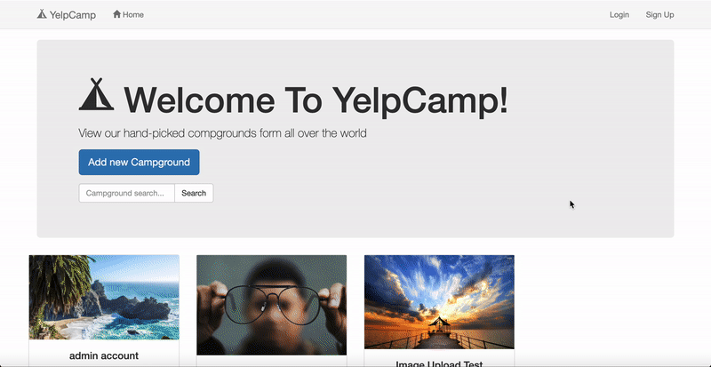

# YelpCamp Project

### Description

Node.js web application with RESTful routing

### Demo Website

You can try the features and functions in the following link of my depolyed website, or see the gif below.

[https://yelpcamp-mcchang.herokuapp.com](https://yelpcamp-mcchang.herokuapp.com)

### Main Function/Feature

* Authentication
* Database Management
* Deploying
* Fuzzy Search
* Landing Page
* Image Upload
* Pagination

### Language and Tools

* Cloudinary
* Heroku
* HTML/CSS/Javascript
* MongoDB
* Node.js

### GIF Demonstration

#### Landing Page

#### Create Account

#### Create Campground

#### Create and Edit Comment

#### Pagination

#### Admin Account

#### Fuzzy Search

